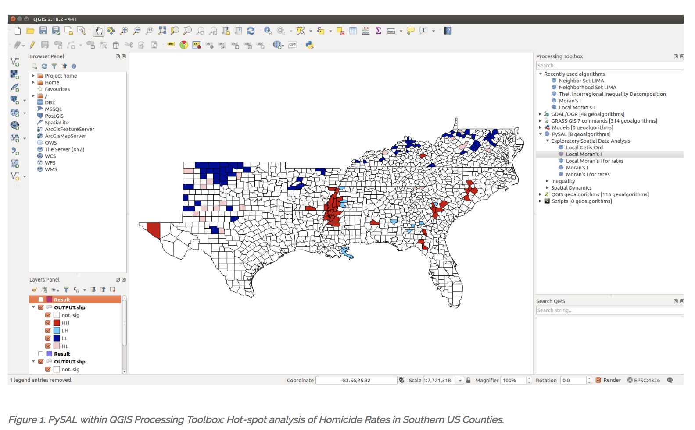

# Introduction to Geographic Information Science for Public Policy (PBPL 273)  
University of California - Winter Quarter 2019

Instructor: [Sergio Rey](https://sergerey.org/about)  

Class Meetings: Tu/Th 3:40-5:30pm, Watkins 2101 

Office Hours: Th 1:00-2:00pm, Center for Geospatial Sciences, Rivera 159

## Course Description

This course introduces the fundamental concepts of geographic information
systems (GIS), geographic information science (GIScience), spatial data, and
applications of spatial analysis in the social sciences and public policy.

The course takes an [explicitly computational thinking](https://computationalthinkingcourse.withgoogle.com/unit) approach to
its pedagogy. Students are introduced to computational concepts and tools that
are increasingly important to public policy and social science research that
engages with geospatial data. By adopting these tools, students acquire a deeper
engagement with, and mastery of, the substantive concepts.

In the scope of a 10-week quarter course we can only introduce a handful of the
key concepts and methods relevant to GIS for Public Policy. As such, the
course is not intended as an exhaustive treatment. Instead, the goal is that
students will acquire an understanding of the more common and useful methods
and practices, and use the course as an entry point for further engagement with the
field.

## Learning Objectives

At the end of this course students will:

-   possess a sound understanding of fundamental spatial concepts and theory;

-   know how to locate, import, manipulate, display, and analyze
    geographical data in open source computational tools;

-   have the ability to apply GIScience concepts and methods in public policy and
    social science research.

## Prerequisites

Graduate standing or consent of instructor.

## Computational Learning

We will using [open source](https://en.wikipedia.org/wiki/Open-source_software) geospatial software throughout the course together with [Jupyter Notebooks](https://jupyter.org), and [Python](https://python.org) as our scripting language. No prior programming experience is assumed and all computational concepts are presented in a self-contained manner.

All software for the course will be made available through [JupyterHub](https://jupyter.org/) a web-based framework. Students wishing to install these materials on their own machines will be given instructions to do so, **but this is not required**.

## Readings

Primary readings supporting the course will be assigned from:

de Smith, M.J, Goodchild, M.F. and Longley, P.A. (2018) _Geospatial Analysis: A Comprehensive Guide to Principles, Techniques and Software Tools_. Winchelsea Press.

Available for [reading on-line](http://www.spatialanalysisonline.com/HTML/index.html) or for [purchase](https://www.amazon.com/Geospatial-Analysis-Comprehensive-Michael-Smith/dp/1912556030).

## Schedule 

Readings are to be done prior to the date listed. Computational Materials will be posted the day of the meeting.

| Week |  Date | Topic                                       | Reading                        | Exercises             |
|------|-------|---------------------------------------------|--------------------------------|-----------------------|
|    1 | 01-08 | Introduction to GIScience                   | [1][ch 1], [2][ch 2]           |                       |
|      | 01-10 | [Introduction to Jupyter and Python][0110a] | [Python for GIS][ucgis]        |                       |
|    2 | 01-15 | Spatial Thinking                            | [2][ch 2]                      |                       |
|      | 01-17 | [Python II][pythonII]                       |                                | [Exercise 1][ex1] Out |
|    3 | 01-22 | Spatial Data in Python                      | [4][ch 4]                      | [Data][data]            |
|      | 01-24 | Mapping and Geovisualization in Python      |                                |                       |
|    4 | 01-29 | Data Integration                            | [4.2][4.2]                     |                       |
|      | 01-31 | Geoprocessing                               |                                | Exercise 1 Due        |
|    5 | 02-05 | Spatial Analysis                            | [5][5], [5.1][5.1], [5.2][5.2] |                       |
|      | 02-07 | EDA for Spatial Data                        |                                | Exercise 2 Out        |
|    6 | 02-12 | Spatial Autocorrelation                     | [5.5][5.5]                     |                       |
|      | 02-14 | Testing for Autocorrelation                 |                                |                       |
|    7 | 02-19 | Surfaces                                    | [6][6]                         |                       |
|      | 02-21 | Interpolation, Heat Maps                    |                                | Exercise 2 Due        |
|    8 | 02-26 | Point Patterns                              | [5.4][5.4]                     |                       |
|      | 02-28 | Distance statistics                         |                                | Exercise 3 Out        |
|    9 | 03-05 | Clustering                                  | [Scipy 2018][Scipy 2018]       |                       |
|      | 03-07 | Geodemographics                             |                                |                       |
|   10 | 03-12 | Big Data and Spatial Analysis               | [9][9]                         |                       |
|      | 03-14 | Next Steps                                  |                                | Exercise 3 Due        |

For those not enrolled in the course, you can interact with these computational materials at the course Binder: .

## Grading

Your course grade will be based on a series of exercises designed to build your
GIS skills, together with a group project and course participation. Details on
the course project will be given out towards the middle of the quarter.

| Component      | Points |
|----------------|-------:|
| Exercise 1     |     20 |
| Exercise 2     |     20 |
| Exercise 3     |     20 |
| Course Project |     35 |
| Participation  |      5 |

The course may be taken Satisfactory (S) or No Credit (NC) with consent
of instructor and graduate advisor.

## Academic Integrity

The UCR student academic integrity policy lists violations in detail.
These violations fall into eight broad areas that include but are not
limited to: cheating, fabrication, plagiarism, facilitating academic
misconduct, unauthorized collaboration, interference or sabotage,
non-compliance with research regulations and retaliation. For more
information about the UCR student academic integrity policy, please use
the following web link
<http://conduct.ucr.edu/policies/academicintegrity.html>

## Disability accommodations

Qualified students with disabilities who will require disability
accommodations in this class are encouraged to make their requests to me
at the beginning of the quarter either during office hours or by
appointment. Note: Prior to receiving disability accommodations,
verification of eligibility from the [Student Disability Resource
Center](http://sdrc.ucr.edu/) is required. Disability information is
confidential.

## Code of Conduct

As course instructor, I am dedicated to providing a harassment-free
learning experience for all students, regardless of gender, sexual
orientation, disability, physical appearance, body size, race, religion,
or choice of operating system. All course participants are expected to
show respect and courtesy to other students throughout the semester. As
a learning community we do not tolerate harassment of participants in
any form.

All communication should be appropriate for a professional audience
including people of many different backgrounds. Sexual language and
imagery are not appropriate in this course.

Be kind to others. Do not insult or put down other students. Behave
professionally. Remember that harassment and sexist, racist, or
exclusionary jokes are not appropriate for PBPL273.

Students violating these rules may be asked to leave the course, and
their violations will be reported to the UCR administration.

This code of conduct is an adaptation of the [SciPy 2017 Code of
Conduct](https://scipy2017.scipy.org/ehome/220975/493434/).

[ch 1]: http://www.spatialanalysisonline.com/HTML/introduction_and_terminology.htm 
[ch 2]: http://www.spatialanalysisonline.com/HTML/conceptual_frameworks_for_spat.htm
[ch 3]: http://www.spatialanalysisonline.com/HTML/methodological_context.htm
[ch 4]: http://www.spatialanalysisonline.com/HTML/building_blocks_of_spatial_ana.htm
[4.2]: http://www.spatialanalysisonline.com/HTML/geometric_and_related_operatio.htm 
[5]: http://www.spatialanalysisonline.com/HTML/building_blocks_of_spatial_ana.htm
[5.1]: http://www.spatialanalysisonline.com/HTML/statistical_methods_and_spatia.htm 
[5.2]:  http://www.spatialanalysisonline.com/HTML/exploratory_spatial_data_analy.htm
[5.4]: http://www.spatialanalysisonline.com/HTML/point_sets_and_distance_statis.htm
[5.5]:  http://www.spatialanalysisonline.com/HTML/spatial_autocorrelation.htm
[6]: http://www.spatialanalysisonline.com/HTML/surface_and_field_analysis.htm
[7]: http://www.spatialanalysisonline.com/HTML/network_and_location_analysis.htm
[SciPy 2018]: http://conference.scipy.org/proceedings/scipy2018/serge_rey.html
[9]: http://www.spatialanalysisonline.com/HTML/afterword.htm

[JupyterHub]: https://geodatascience.net/hub/user-redirect/git-pull?repo=https%3A%2F%2Fgithub.com%2Fsjsrey%2Fpbpl273w19&app=notebook 
[0110a]: https://geodatascience.net/hub/user-redirect/git-pull?repo=https%3A%2F%2Fgithub.com%2Fsjsrey%2Fpbpl273w19&branch=master&subPath=notebooks%2F0110%2FA0_notebook_intro.ipynb&app=notebook
[pythonII]: https://geodatascience.net/hub/user-redirect/git-pull?repo=https%3A%2F%2Fgithub.com%2Fsjsrey%2Fpbpl273w19&branch=master&subPath=notebooks%2F0110&app=notebook
[0110b]: https://geodatascience.net/hub/user-redirect/git-pull?repo=https%3A%2F%2Fgithub.com%2Fsjsrey%2Fpbpl273w19&branch=master&subPath=notebooks%2F0110&app=notebook
[data]: https://geodatascience.net/hub/user-redirect/git-pull?repo=https%3A%2F%2Fgithub.com%2Fsjsrey%2Fpbpl273w19&branch=master&subPath=notebooks%2Fdata&app=notebook
[gp]: https://geodatascience.net/hub/user-redirect/git-pull?repo=https%3A%2F%2Fgithub.com%2Fsjsrey%2Fpbpl273w19&branch=master&subPath=notebooks%2F0117&app=notebook
[ucgis]: https://gistbok.ucgis.org/bok-topics/python-gis
[binder]: https://mybinder.org/v2/gh/sjsrey/pbpl273w19/master
[ex1]:  https://geodatascience.net/hub/user-redirect/git-pull?repo=https%3A%2F%2Fgithub.com%2Fsjsrey%2Fpbpl273w19&branch=master&subPath=notebooks%2Fexercises%2F01&app=notebook
